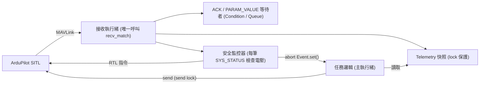

# 03 — 架構規劃

> 這是**建議**架構，接手者可調整，但若偏離請在 `NOTES.md` 說明原因。

## 1. 目標檔案結構

```
allswell_embedded_interview/
├── part1_takeoff.py        # Part 1 入口
├── part2_square.py         # Part 2 入口
├── part3_failsafe.py       # Part 3 入口
├── NOTES.md                # 交付筆記（英文，約半頁）
├── starter/
│   ├── __init__.py         # 新增，讓 starter 成為 package
│   ├── drone.py            # Drone 類別（擴充現有骨架；接收執行緒先直接寫在這裡）
│   ├── link.py             # 【選做】把 MAVLink I/O 從 drone.py 拆出來（只在重構階段做）
│   ├── geo.py              # 純函式：距離、偏移座標、正方形角點
│   ├── mission.py          # 共用流程：takeoff_sequence、fly_square、rtl_and_wait（Part 2 開始需要）
│   └── telemetry.py        # 原樣保留
├── tests/
│   ├── test_geo.py         # 建議（成本低、價值高）
│   └── test_drone_logic.py # 【選做】用假連線（fake conn）測 ACK/timeout 處理
└── docs/                   # 本文件
```

入口腳本以 `from starter.drone import Drone, DroneError` 匯入（從 repo 根目錄執行）。

> **選做項目總表**（Part 1–3 都在 SITL 上跑通後才做）：`link.py` 拆分、GCS 心跳、Ctrl+C 時自動下 RTL、CLI 參數或環境變數覆寫連線字串、假連線測試、Bonus。

## 2. 並行模型（關鍵決策）

### 問題
Part 3 要「任務邏輯」與「電池監控」同時進行並共用一條連線；而 `pymavlink` 連線物件不保證執行緒安全，多處同時 `recv_match()` 會互相「偷走」訊息（例如監控器吃掉了任務在等的 `COMMAND_ACK`）。

### 建議方案：**單一接收執行緒 + 共享狀態 + 事件**



- **接收執行緒**：唯一呼叫 `conn.recv_match(blocking=True, timeout=0.5)` 的地方。每收到一筆訊息：
  - 更新 `Telemetry` 快照（mode、armed、lat/lon/rel_alt、voltage、ekf_flags、gps_fix、landed_state、last_heartbeat_time）。
  - `COMMAND_ACK`、`PARAM_VALUE`、`STATUSTEXT` 推入對應的佇列/通知等待中的呼叫者。
  - 呼叫已註冊的監聽器（listener），例如電池監控器。
- **送出**：所有 `conn.mav.*_send()` 用一把 `send_lock` 保護。
- **任務邏輯**（主執行緒）：讀快照、等條件（`wait_until(predicate, timeout)`），每次迴圈檢查 `abort_event`；一旦被設置，**立即停止送 goto** 並拋出 `MissionAborted`。
- **安全監控器**：電壓 < 11.0 V 時：記錄時間戳 + 原因 → `abort_event.set()` → 送出 RTL（**只送不等**）。主執行緒接手確認 RTL 並等待落地。
- **GCS 心跳**（選做）：另一個小執行緒每 1 秒送一次 `HEARTBEAT`（`MAV_TYPE_GCS`），模擬真實地面站行為。

### ⚠️ 規則 A：listener 內只能做「不會卡住」的事（避免死鎖）

listener 是在**接收執行緒**中被呼叫的，而接收執行緒正是負責分派 `COMMAND_ACK` 的唯一執行緒。若 listener 裡呼叫任何會「等待回應」的函式（`send_command_long()`、`set_mode()`、`set_param()`、`wait_until()`），接收執行緒會卡住、ACK 永遠不會被分派 → **死鎖**。

| listener 內 ✅ 允許 | listener 內 ❌ 禁止 |
|---|---|
| 寫 log | `send_command_long()`（等 ACK） |
| `abort_event.set()` | `set_mode()` / `set_param()` / `wait_until()` |
| 只送不等的 `command_long_send(DO_SET_MODE, RTL)`（取得 `send_lock` 後直接送） | 任何 `time.sleep()` 或阻塞 I/O |

建議 `Drone` 提供一個明確的只送不等方法，例如 `request_mode_nowait("RTL")`，讓 listener 只能呼叫它。

**RTL 的確認一律交給主執行緒**：主執行緒捕捉 `MissionAborted` 後：
1. 若 `HEARTBEAT` 已顯示 RTL（或自駕儀自身 failsafe 切到 LAND）→ 視為已確認並記錄。
2. 否則呼叫 `set_mode("RTL")`（ACK + HEARTBEAT 確認）。listener 先前送出的那一筆所回的 ACK 也是 cmd 176，等待者接受任一筆皆可。
3. 再 `wait_landed_disarmed()`。

### ⚠️ 規則 B：中止與其他等待的競爭條件

1. **`wait_until` 要可選擇是否受中止影響**：介面加參數 `abortable: bool`。
   - 任務階段（`fly_to`、正方形航程）：`abortable=True`，中止時拋 `MissionAborted`。
   - 中止後的收尾（`set_mode("RTL")`、`wait_landed_disarmed()`）以及 `set_param()`：`abortable=False`，否則收尾本身會被自己的中止打斷。
2. **`set_param()` 不受 `abort_event` 影響**：故障注入後電壓會立刻下降，監控器很可能在 `PARAM_VALUE` 回來前就觸發中止。`set_param()` 必須**照常完成確認並記錄**「參數已確認」那一行（原題明確要求確認）。若故障注入是在背景執行緒（例如 `threading.Timer`）執行，主執行緒結束前要 `join()` 它，確保確認結果有寫進日誌；若確認失敗，即使中止與返航成功，也應以非零結束並寫明原因。
3. **中止後一筆 goto 都不能再送**：`goto()` 必須在 `send_lock` **內**再檢查一次 `abort_event`：

```python
def goto(self, lat, lon, alt_m):
    with self._send_lock:
        if self.abort_event.is_set():
            raise MissionAborted("abort set; goto suppressed")
        self.conn.mav.set_position_target_global_int_send(...)
```

監控器端則是「先 `abort_event.set()`，再取得 `send_lock` 送 RTL」。兩邊共用同一把鎖，因此 RTL 之後不可能再出現任何 goto。

### 為什麼選這個（可寫進 NOTES.md）
- 單一讀取者 → 沒有訊息被搶走的競爭問題；ACK 一定送達等待者。
- 安全監控在**每筆**遙測到達時立即評估，不受任務邏輯阻塞影響（例如任務正在等某個 ACK 時，監控器仍可運作）。
- 比 asyncio 簡單：`pymavlink` 是阻塞式 API，硬套 asyncio 需要 `run_in_executor`。
- Part 1/2 也用同一套 `Drone` 類別，Part 3 只是多註冊一個監聽器 → 程式碼重用最大化。

### 替代方案（可在 NOTES.md 比較）
| 方案 | 優點 | 缺點 |
|---|---|---|
| 單迴圈狀態機 | 無鎖、可預測、易測 | 所有邏輯需改寫成非阻塞步驟，可讀性較差 |
| asyncio | 結構清晰 | pymavlink 阻塞，需包裝 |
| 多執行緒各自 recv | 寫起來最快 | **錯誤**：訊息被搶，禁止使用 |

## 3. `Drone` 類別介面（建議）

```python
class DroneError(Exception): ...          # 已存在：指令被拒 / 逾時
class MissionAborted(DroneError): ...     # 安全監控觸發中止

class Drone:
    def __init__(self, connection_string="tcp:127.0.0.1:5760", log=None): ...
    def close(self) -> None: ...

    # --- 低階 ---
    def send_command_long(self, command, *params, timeout=5.0, retries=2) -> None
        # 送 COMMAND_LONG，等對應 command 的 COMMAND_ACK；
        # ACCEPTED 返回，IN_PROGRESS 繼續等，其他結果 raise DroneError(帶結果名稱)
        # 重送時 confirmation 欄位遞增
    def wait_until(self, predicate, timeout, desc, abortable=False) -> None
        # 輪詢快照直到 predicate 為真；逾時 raise DroneError(desc)
        # abortable=True 時，abort_event 被設置就 raise MissionAborted（見規則 B）
    def request_mode_nowait(self, mode_name) -> None
        # 只送 DO_SET_MODE、不等 ACK；listener 唯一可用的指令方法（見規則 A）

    # --- 高階 ---
    def wait_ready_to_arm(self, timeout=120.0) -> None
    def set_mode(self, mode_name, timeout=10.0) -> None
    def arm(self, timeout=30.0) -> None
    def takeoff(self, altitude_m, timeout=60.0, on_progress=None) -> None
    def goto(self, lat, lon, alt_m) -> None          # 送一次位置目標（無阻塞）；在 send_lock 內檢查 abort_event
    def fly_to(self, lat, lon, alt_m, radius_m=2.0, timeout=90.0, on_progress=None) -> None
        # 迴圈：每 ~1 s 重送 goto + 回報距離，直到水平距離 ≤ radius_m（abortable=True）
    def wait_landed_disarmed(self, timeout=180.0) -> None   # abortable=False
    def set_param(self, name, value, timeout=5.0, retries=3) -> float   # 不受 abort_event 影響

    # --- 狀態 ---
    @property
    def telemetry(self) -> TelemetrySnapshot      # dataclass 複本
    abort_event: threading.Event
    def add_listener(self, callback) -> None      # callback(msg) 於接收執行緒呼叫
```

## 4. `geo.py`（純函式，需單元測試）

```python
EARTH_RADIUS_M = 6_378_137.0
def offset_latlon(lat, lon, north_m, east_m) -> tuple[float, float]
    # dlat = north / R ; dlon = east / (R * cos(lat))  （80 m 尺度下平面近似足夠）
def horizontal_distance_m(lat1, lon1, lat2, lon2) -> float   # haversine 或等距圓柱近似
def square_corners(lat, lon, side_m=80.0, heading="NE") -> list[tuple[float, float]]
    # 回傳 [A, B, C, D, A]，例如 A→北 80 m→東 80 m→南 80 m→回 A
```

## 5. 日誌格式（全專案統一）

- 統一使用**完整 ISO 8601 本地時間 + 毫秒**（含日期），所有 Part 與中止記錄都用同一格式：`2026-10-04T02:51:07.123`
- 設定方式（**必須指定 `datefmt`**，否則預設的 `asctime` 已含 `,mmm`，再接 `%(msecs)03d` 會出現重複的毫秒）：

```python
logging.basicConfig(
    level=logging.INFO,
    format="%(asctime)s.%(msecs)03d %(levelname)-7s %(message)s",
    datefmt="%Y-%m-%dT%H:%M:%S",
)
```

- 中止記錄的訊息內容本身也要帶時間戳與原因（原題要求「log the abort reason with a timestamp」），時間戳即日誌行首，訊息寫明原因與當下航段即可。
- 範例（Part 3 預期輸出節錄）：

```
2026-10-04T02:51:07.120 INFO    Connected: system 1 component 1
2026-10-04T02:51:52.004 INFO    EKF ready (flags=0x...), GPS fix 3D
2026-10-04T02:51:52.310 INFO    Mode -> GUIDED (confirmed)
2026-10-04T02:51:52.620 INFO    Armed (ack + heartbeat)
2026-10-04T02:52:01.900 INFO    REACHED 15.0 m
2026-10-04T02:52:02.000 INFO    Leg 1/4: 78.3 m to corner B
...
2026-10-04T02:52:22.000 INFO    Fault injection: setting SIM_BATT_VOLTAGE=10.5
2026-10-04T02:52:22.050 INFO    Fault injection: SIM_BATT_VOLTAGE=10.50 confirmed via PARAM_VALUE
2026-10-04T02:52:22.300 WARNING ABORT: battery 10.50 V < 11.00 V during leg 2/4; goto stopped, RTL requested
2026-10-04T02:52:23.100 INFO    Mode -> RTL (confirmed)
2026-10-04T02:53:10.400 INFO    Landed and disarmed. Mission aborted safely.
```

> 「參數已確認」與「ABORT」兩行的先後順序可能互換（`SYS_STATUS` 可能比 `PARAM_VALUE` 先到），兩種都正確；重點是**兩行都必須出現**（見 §2 規則 B）。

## 6. 退出碼約定

| 碼 | 意義 |
|---|---|
| 0 | 成功（Part 3：成功偵測並安全返航也是 0） |
| 1 | `DroneError`（拒絕、逾時、連線問題） |
| 2 | 參數 / 使用方式錯誤 |
| 130 | 使用者 Ctrl+C |
